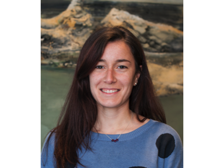

Anna Quaglieri
--------------

### Contact details

-   **Lab**: Speed, Speed
-   **Division**: Not available, Bioinformatics
-   **Contact email**: <quaglieri.a@wehi.edu.au>, <quaglieri.a@wehi.edu.au>

### Equipment experience

RNA-Sequencing, Variant calling, ChIp-Seq, Statistics , Statistics, visualisation with R, Leukemia

### Lab skills

Not available, Not available

### Equipment experience

Not available, Not available

### Software experience

Not available, R, bash script

### Professional development

Not available, Not available

### Hobbies/Interests

Footy, Gym, Running, Samba, Photography, Coding , AFL, Samba, Photography
